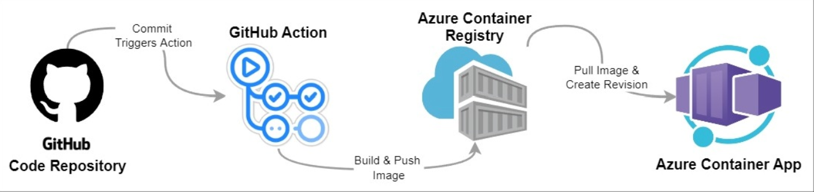

# Challenge 3: Deploy Microservices to Azure Container Apps via GitHub Actions

[Previous Challenge](./02-Azure-Container-Apps.md) - **[Home](../README.md)** - **[Next Challenge](./04-FrontDoor.md)**

## Introduction

Our application is now running on Azure, which is great, but we can still use some tools to optimize it.
So far if we'd make any changes to the source code we would have to build the application locally, create a new image, push it to the Container Registry and creating a Revision of the subject Container App manually. To enhance this process we can use GitHub Actions to automate the build and deploy process. 
GitHub Actions is designed to help simplify workflows with flexible automation and offer easy-to-use CI/CD capabilities. Building a workflow pipeline with GitHub Actions will make the deployment more efficient and it's possible to automate everything within the GitHub repositories. 

## Challenge

* Create a build pipeline for the services that creates an Image of your code and pushes it to the ACR whenever there is a new merge. Basically automate what you've done  in Challenge 1.
* Create a release pipeline for our application that runs tests, enforces lint and  deploys the app to the production environment, automating what you've done manually in Challenge 2.

## Success Criteria

* Pushing a commit to the GitHub repository automatically trigger the GitHub actions build pipeline
* New builds are pushed directly to the ACR
* New versions on ACR trigger a run of the release pipeline
* Triggered Workflows can be followed in the live logs.

## Learning Resources
* [GitHub Actions](https://resources.github.com/devops/tools/automation/actions/)
* [CI/CD pipeline with GitHub Actions](https://github.blog/2022-02-02-build-ci-cd-pipeline-github-actions-four-steps/)
