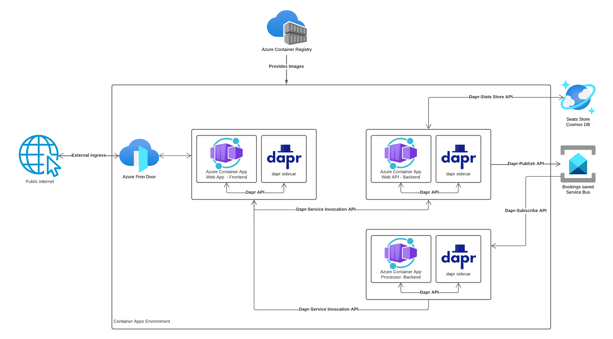

# Build a serverless microservices architecture

## Introduction and context

In this MicroHack we are going to cover the construction of a serverless microservices architecture.

Microservices are independent modules that take care of a single service, and can be independently built, verified, deployed, scaled and monitored. 
A serverless architecture is a model within cloud computing where the service provider handles the infrastructre management, so developers don't have to deal with providing servers and can focus on the code itself.
Serverless microservices combine the two concepts above. So they are independent modules deployed within a serverless  infrastructure and only run when they are needed by the application thus minimizing the cost to only what is actually used.


## Learning Objectives

In this hack you will learn how to set up a whole microservice architecture in a small scenario in your own environment. Once we deployed the basic application, we will take a look at Azure Frontdoor and more insights, on how to monitor and manage your new setup.

## Content and Challenges

* Getting started and setting up the environment
* Build and push Microservice Images locally
* Deploy Microservices to Azure Container App
* Deploy Microservices to Azure Container App via GitHub Actions
* Integrate Azure Front Door
* Monitor performance with Azure Front Door

## Prerequisites

* VS Code
* Azure Subscription
* Azure CLI
* Resource Group with contributor rights
* GitHub with GitHub Actions
* Docker

### Challenge 0: Getting started and setting up the environment

#### Introduction

Modern microservices are normally running on a cloud environment and are the go to architecture for applications and plattforms. This introduction will tell you more about the topic in general.
This intro will ensure that all pre-requesites and concepts to start planning and deploying the architecture are in place.

The challenge will be to setup the basic Azure resources we need to fulfill our goal in deploying an app based on microservices. For this we need to create a container registry and a container app environment.

#### Architecture

To have a relateable scenario, we will create a booking system for an airline, where customers can book their seats and receive a bill.

Real world scenarios can include up to hundreds of microservices within an environment. To keep at as simple as possible for this microhack we will only work with three microservices within a single environment. 

Below you can find the architecture diagram of the application we are going to build:

<<picture>>


* Web App front-end application shows users the available seats for the airline and lets them choose their preferred seats.
<<picture of frontend>>
Customers can click on their preferred amount and location of seats and book them with the "book" Button. The front-end will show an order confirmation and the booked seats will no longer be available for booking. 
<<picture of confirmation in frontend>>

* Backend Web API which contains the business logic of bookings management service and data storage. It stores the seats in a database and carries out the booking process by assigning the customer to the chosen seats. 

* Event-driven backend processor which is responsible for sending the bills to customers based on the messages that are coming from the Service Bus. It is subscribed to the Backend Web API and will send out the booking confirmation to be shown in the front-end when a booking has taken place.


#### Components

* Azure resource groups are logical containers for Azure resources. You use a single resource group to structure everything related to this solution in the Azure portal.

* Azure Container Registry to build and host container images and deploy images from the Azure Container Registry to the Container Apps.

* Azure Container Apps is a fully managed, serverless container service used to build and deploy modern apps at scale. The underlying Service is Azure Kubernetes which provides you with the needed infrastructure. In this solution, you're hosting all microservices on Azure Container Apps and deploying them into a single Container App environment. This environment acts as a secure boundary around the system.

* Dapr provides a set of APIs that simplify the authoring of microservice applications. Once you enable Dapr in Azure Container Apps, it exposes its APIs via a sidecar. Use it for Service to Service invocation between Frontend and Backend, State Managment and Pub/Sub.

* Azure Service Bus is a fully managed enterprise message broker complete with queues and publish-subscribe topics. In this solution, use it for the Dapr pub/sub component implementation. The Web API publishes messages on the bus, and the Processor Backend subscribes to these messages and sends the bills out to customers.

* Azure Cosmos DB is a NoSQL, multi-model managed database service. Use it as a Dapr state store component for the Web API Backend.

* Azure Front Door is an application delivery network as a service that offers dynamic site accerleration as well as global load balancing with near real-time failover.
It also works as a global, scalable entry-point to protect and decouple the inner structure from incoming traffic.

#### Install/Upgrade Azure Container Apps Extension (?)
To be able to work with Azure Container Apps on the azure CLI you want to make sure you have the Container Apps extension installed.

Open your PowerShell or Bash console and sign in to Azure from the CLI.
```
az login
```

If you have multiple Azure subscriptions under your account you need to select the subscription you want to use.
```
az account set --subscription <name>
```

Ensure your CLI is updated to the latest version.

```
az upgrade
```

Now you can install/update the Azure Container Apps extension for CLI.

```
az extension add --name containerapp --upgrade
```

If you haven't already, register the "Microsoft.App" and "Microsoft.OperationalInsights" namespaces.

```
az provider register --namespace Microsoft.App
az provider register --namespace Microsoft.OperationalInsights
```

#### Challenge

* Use coherent Naming conventions for resources
* Set up an Azure Container registry with admin account
* Create a Container App environment for multiple container apps in West Europe Region
* Key-Value Store
* Create a Cosmos-DB Database for (?) API
* Basic permission concept for accessing resources

#### Success Criteria

* Naming convention defined
* Azure container registry is deployed and accessable
* App environment is present
* Key-value store deployed
* Database deployed
* Permission concept is created

#### Learning Resources

* Microservices with Container Apps and Dapr: https://docs.microsoft.com/en-us/azure/architecture/example-scenario/serverless/microservices-with-container-apps-dapr
* Microservices with Azure Container Apps: https://docs.microsoft.com/en-us/azure/container-apps/microservices
* Container Registry: https://docs.microsoft.com/en-us/azure/container-registry/container-registry-get-started-azure-cli
* Container App Environment: https://docs.microsoft.com/en-us/azure/container-apps/environment 
* Cosmos DB: https://learn.microsoft.com/en-us/azure/cosmos-db/sql/create-cosmosdb-resources-portal 

<<tbd>>

### Challenge 1: Build and push Microservice Images locally

#### Introduction

In this Repository we have provided the code for the example application for an airline booking service as described in Challenge 0. <<link>>
To later be able to deploy them in Container Apps we first have to build Images of each microservice via docker. 
APIs are an important part of communication between the microservices. If you want to challenge yourself a little more, you are free to code them yourself, otherwise they are also provided in this repository.

#### Challenge

* Optionally: Communication between frontend and backend
* Create docker images of the microservices
* Push the images to your ACR
* Bookings are stored in database (?)

#### Success Criteria

* Application runs locally
* Images are pushed to the ACR
* Images can be pulled from the ACR

#### Learning Resources
* Push to Container Registries: https://docs.microsoft.com/en-us/azure/container-registry/container-registry-get-started-docker-cli?tabs=azure-cli 

<<tbd>>

### Challenge 2: Deploy your app as container apps

#### Introduction

Since our images are now push- and pullable from our registry and the environment is set up, we can deploy our microservices to Azure. As described in the intro, we will be using Azure Container Apps. The Azure Container Apps service enables you to run microservices and containerized applications on a serverless platform. With Container Apps, you enjoy the benefits of running containers while you leave behind the concerns of manually configuring cloud infrastructure and complex container orchestrators.
We also want to enable Dapr in our Azure Container Apps, so we can use it for Service to Service invocation between Frontend and Backend, State Store Managment of the Database and Pub/Sub between the publishing Web API-Backend and the subscribing Processor Backend.

#### Challenge

* Create Container Apps for each microservice 
* West Europe as region
* Part of our Container App environment
* Images are pulled from the ACR
* Basic Security is set up (?)

#### Success Criteria

* All Services are deployed in the environment
* The frontend is accessible under public DNS and/or IP
* If you choose and book seats you'll get a confirmation: <<image>>
* Booked seats are saved in the database
* Backend is not reachable publicly

#### Learning Resources
* Benefits of Container Apps: https://docs.microsoft.com/en-us/azure/container-apps/compare-options 
* dapr: https://docs.dapr.io/concepts/overview/ 

<<tbd>>

### Challenge 3: Deploy Microservices to Azure Container App via GitHub Actions

#### Introduction

Our application is now running on Azure, which is great, but we can still use some tools to optimize it. First thing is to automate the deployment via Github actions.
GitHub Actions is designed to help simplify workflows with flexible automation and offer easy-to-use CI/CD capabilities. Building a workflow pipeline with GitHub Actions will make the deployment more efficient and it's possible to automate everything within the GitHub repositories. 

#### Challenge

* Create a build pipeline for the services that creates an Image of your code and pushes it to the ACR whenever there is a new merge. Basically automate what you've done  in Challenge 1.
* Create a release pipeline for our application that runs tests, enforces lint and  deploys the app to the production environment, automating what you've done manually in Challenge 2.

#### Success Criteria

* Merges to the code automatically trigger the build pipeline
* New builds are pushed directly to the ACR
* New versions on ACR trigger a run of the release pipeline
* Triggered Workflows can be followed in the live logs.

#### Learning Resources
* GitHub Actions: https://resources.github.com/devops/tools/automation/actions/
* CI/CD pipeline with GitHub Actions: https://github.blog/2022-02-02-build-ci-cd-pipeline-github-actions-four-steps/ 


<<tbd>>

### Challenge 4: Integrate Azure Front Door

#### Introduction

To be able to use the full potential of Azure for our new application, we want to add Azure Front Door to our environment. Front Door enables you to define, manage, and monitor the global routing for your web traffic by optimizing for top-tier end-user perfomrance and reliability. It includes a range of traffic-routing methods and backend health monitoring options.

#### Challenge

* Add Azure Front Door to your platform
* Use Azure for monitoring your application

#### Success Criteria

* Front Door used in the environment
* Metrics can be watched
* Logs can be read

#### Learning Resources
* Azure Front Door: https://learn.microsoft.com/en-us/azure/frontdoor/front-door-overview 
* Azure Front Door (classic): https://learn.microsoft.com/en-us/azure/frontdoor/classic-overview 
* Implementing Front Door: https://learn.microsoft.com/en-us/azure/frontdoor/quickstart-create-front-door 


<<tbd>>

### Challenge 5: Monitor performance with Azure Front Door

### Introduction
So far we implemented Front Door to our error-free application. That's nice but doesn't really show what Front Door is capable of and what we can do if an error occurs. In this last challenge we will therfor ....

### Challenge

### Success Criteria

### Learning Resources

## Solution Guide
